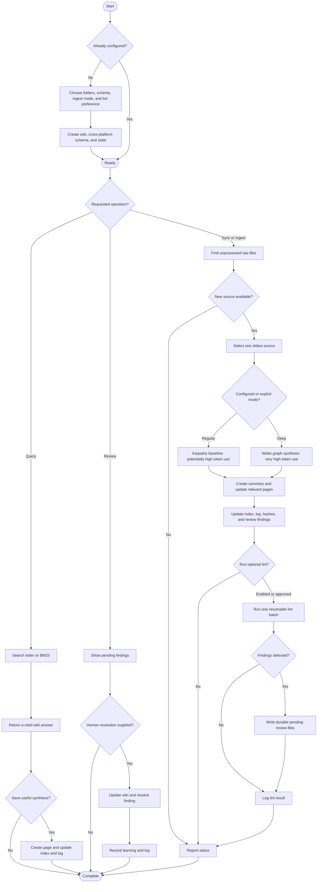

# Second Brain OS

A Codex and Claude Code plugin that turns raw notes, transcripts, articles, PDFs, and other
sources into a maintained, interlinked Markdown wiki. It implements
[Andrej Karpathy's LLM Wiki pattern](https://gist.github.com/karpathy/442a6bf555914893e9891c11519de94f):
knowledge is compiled into a persistent wiki instead of being rediscovered from raw documents
for every question.

## Core model

- **Raw sources** are immutable and only read by the agent.
- **`wiki/`** is maintained by the agent and contains pages, an index, a log, learnings,
  archives, and a durable review queue.
- **`AGENTS.md` and `CLAUDE.md`** contain the same generated schema so the wiki behaves
  consistently in Codex and Claude Code.

Ingestion processes one source per invocation. Contradictions are never silently resolved: each
one becomes a file in `wiki/review/pending/` until a human decides what is correct. Human
resolutions become durable learnings for future ingests.

## End-to-end flow

There is no scheduler or background sync. Every sync starts with an explicit user request.

## Token-usage warnings

- **Deep ingest — very high:** deliberately searches the wider graph for second-order
  connections and additional synthesis.
- **Regular ingest — moderate to high:** follows Karpathy's baseline without a page cap; a long
  source may genuinely update 10-15 pages.
- **Bootstrap lint — controlled but potentially high in total:** structural checks consume no
  model tokens, while semantic checks run in resumable 15-page batches against up to three
  related pages.
- **Incremental lint — usually low to moderate:** after bootstrap, only changed pages and their
  strongest candidate matches receive semantic review.
- **Query — usually low to moderate:** reads only search results and the pages needed to answer.

## Components

| Component | Type | Purpose |
|---|---|---|
| `second-brain` | Skill | Routes setup, sync, ingest, query, lint, and review requests. |
| `init` | Skill | Creates the wiki, dual-platform schema, configuration, and state. |
| `ingest` | Skill | Directly integrates one source using regular or deep mode. |
| `query` | Skill | Searches the wiki and returns cited answers. |
| `lint` | Skill | Runs deterministic checks and bounded incremental semantic review. |
| `review` | Skill | Lists and resolves durable findings and records human learnings. |
| `scripts/bm25_search.py` | Script | Dependency-free relevance search for larger wikis. |
| `scripts/wiki_lint.py` | Script | Deterministic checks and resumable incremental lint state. |
| `hooks/hooks.json` | Claude Code hook | Prevents writes to the configured raw-source folder. |

## Setup and usage

After installing the plugin, open the project that will contain the source folder and say:

> Set up a second brain.

Setup asks for the raw folder, topic, source types, scale, page types, default ingest mode, lint
preference, and optional staleness threshold. It creates both `AGENTS.md` and `CLAUDE.md`.

Useful requests:

- `Sync my second brain` — process the next unprocessed source.
- `Regular ingest raw/meeting.md` — use Karpathy's baseline for one source.
- `Deep ingest raw/research-report.pdf` — add a wider graph-enrichment pass.
- `What does my second brain know about X?` — query the compiled wiki.
- `Run lint on my second brain` — run or resume one lint batch.
- `What needs my review?` — list durable unresolved findings.

## Plugin packaging

The same repository contains both manifests:

- `.codex-plugin/plugin.json` for Codex.
- `.claude-plugin/plugin.json` for Claude Code.

Both platforms load the shared `skills/` and `scripts/` directories. Claude Code additionally
loads its raw-folder protection hook. Codex enforces raw-source immutability through the shared
skill and generated `AGENTS.md` instructions.

For Claude Code, add the repository as a plugin source and install `second-brain-os` using the
plugin UI or CLI available in your Claude Code version. For Codex, install the repository through
the Codex plugin UI or include it in a Codex marketplace; the native manifest requires no source
conversion.

## Requirements

- Codex or Claude Code.
- Python 3 for BM25 search and low-token lint.
- Obsidian is optional for browsing the wiki graph.

## Credit

Based on [Andrej Karpathy's LLM Wiki idea](https://gist.github.com/karpathy/442a6bf555914893e9891c11519de94f).
